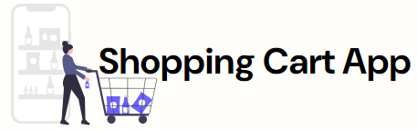

<!-- Improved compatibility of back to top link: See: https://github.com/othneildrew/Best-README-Template/pull/73 -->

<a name="readme-top"></a>

<!--
*** Thanks for checking out the Best-README-Template. If you have a suggestion
*** that would make this better, please fork the repo and create a pull request
*** or simply open an issue with the tag "enhancement".
*** Don't forget to give the project a star!
*** Thanks again! Now go create something AMAZING! :D
-->

<!-- PROJECT SHIELDS -->
<!--
*** I'm using markdown "reference style" links for readability.
*** Reference links are enclosed in brackets [ ] instead of parentheses ( ).
*** See the bottom of this document for the declaration of the reference variables
*** for contributors-url, forks-url, etc. This is an optional, concise syntax you may use.
*** https://www.markdownguide.org/basic-syntax/#reference-style-links
-->
<!-- [![Contributors][contributors-shield]][contributors-url] -->
<!-- [![Forks][forks-shield]][forks-url]
[![Stargazers][stars-shield]][stars-url]
[![Issues][issues-shield]][issues-url]
[![MIT License][license-shield]][license-url]
[![LinkedIn][linkedin-shield]][linkedin-url] -->

<!-- PROJECT LOGO -->
<br />
<div align="center">
  <a href="https://github.com/mikeyCos/cv-application">
    
  </a>

<h3 align="center">Shopping Cart</h3>

  <p align="center">
    Shopping Cart is a simple 
    <br />
    <a href="https://github.com/github_username/repo_name"><strong>Explore the docs »</strong></a>
    <br />
    <br />
    <a href="https://shoppingcart-mikeycos.netlify.app/">Live Preview</a>
    <!-- ·
    <a href="https://github.com/github_username/repo_name/issues/new?labels=bug&template=bug-report---.md">Report Bug</a>
    ·
    <a href="https://github.com/github_username/repo_name/issues/new?labels=enhancement&template=feature-request---.md">Request Feature</a> -->
    ·
    <a href="https://github.com/mikeyCos/shopping-cart/blob/main/CHANGELOG.md">Changelog</a>
  </p>
</div>

<!-- TABLE OF CONTENTS -->
<details>
  <summary>Table of Contents</summary>
  <ol>
    <li>
      <a href="#about-the-project">About The Project</a>
      <ul>
        <li><a href="#built-with">Built With</a></li>
      </ul>
    </li>
    <li>
      <a href="#getting-started">Getting Started</a>
      <ul>
        <li><a href="#prerequisites">Prerequisites</a></li>
        <li><a href="#installation">Installation</a></li>
      </ul>
    </li>
    <li><a href="#usage">Usage</a></li>
    <li><a href="#roadmap">Roadmap</a></li>
    <!-- <li><a href="#contributing">Contributing</a></li> -->
    <!-- <li><a href="#contact">Contact</a></li> -->
    <li><a href="#acknowledgments">Acknowledgments</a></li>
    <li><a href="#questions">Questions</a></li>
  </ol>
</details>

<!-- ABOUT THE PROJECT -->

## About The Project

[![Shopping Cart Screen Shot][product-screenshot]](https://shoppingcart-mikeycos.netlify.app/)

Project: Shopping Cart

Hello world,

The Shopping Cart project is my third project built with React and JavaScript. Also, this is the first time I used CSS Modules and React Router on a project-scale. At the time of creating the project, this was the third and last React project in The Odin Project's React Course. The Shopping Cart project's objectives were meant to practice previous React concepts which included but not limited to component lifecycle, React testing, type checking with PropTypes, React Router, and CSS Modules. There were many instances I found myself staring at lines of code in confusion and despair. In time, those lows were meant with highs of success. Despite the headaches, I am thrilled with what I failed, practiced, and implemented.

How does the application work? On load or on refresh, a spinner-like component is rendered until data has been loaded and then application's content is rendered. The application of three main regions: the `header`, `main`, and `footer`. The header includes the logo paired with the title of the application, and a set of links (`Home`, `Shop`, `Shopping Cart (icon)`, `GitHub (icon)`). Note, only `Home`, `Shop`, and the `Shopping Cart (icon)` are used as routes in the `header`. The root, a pathway of `/`, of the application defaults to a placeholder home page.

Both the logo and `Home` on click will navigate users to the `Home` page. Clicking `Home`, `Shop`, and the `Shopping Cart (icon)` will change the content inside the `main` tag. The `Shop` page renders a list of categories: `All`, `Electronics`, `Jewelery`, `Men's Clothing`, and `Women's Clothing`. The categories are links and are used as routes. Therefore, clicking on any of these links will only change the content inside the `section` tag with `id='category'` and it's respective items/products. As the category name, `All`, implies, renders all items/products being sold in the shop. Clicking `Electronics` will render item/product cards that are considered electronics. Each item/product card contains a picture of item/product, title of item/product and it's price. Futhermore, hovering over an item/product's card will reveal a button to add one quantity of said item/product.

Clicking the item/product's card render's a modal containing more information of the clicked item/product. The information includes a item/product picture, short description on the item/product, price, increment/decrement buttons, a quantity input, and a 'Add to cart' button. On the modal, the increment/decrement buttons will increase/decrease the quantity input's value by one; the value never gets set to zero or above nine-hundred and ninety-nine. A user can manually type a number into the input. The quantity input's value cannot be blank or zero, otherwise an error message will be revealed after trying to add the item/product to the cart. Adding and removing unique items from the cart will update the number floating near the `Shopping Cart` icon, and icon will shake. In other words, adding the exact same item more than once will not update the number nor shake the `Shopping Cart` icon.

Similarly to the `Shop` page, the `Cart` page will render item/product cards, and the cart's subtotal (in United States dollar). However, if there are no items in the cart, then only the text "Your cart is empty" will be rendered. Each item/product card contains the title of the item/product, a picture of item/product, it's price, increment/decrement buttons, a quantity input with it's current value, and a 'Delete' button. Clicking the decrement button when the quantity input's value is one will automatically remove the item/product from the cart. Likewise, clearing the quantity input's value with the `backspace` key will remove the item/product from the cart. Incrementing/decrementing quantities and/or removing item/products from the cart will update the cart's subtotal.

In the tradition of past projects, I implemented more than what is required by the project specifications. I used React Router one step further by defining and making use of a `loader` in my routes. Originally, I was fetching data from an API in a `useEffect` hook defined in the `Shop` component. This means each time the `Shop` page was rendered, a spinner-like component is temporarily rendered, a request is sent to an API, the request gets resolved, and the `Shop` page rerenders using the resolved data. Using a `loader` in my routes resolved the `Shop` component from rendering and refetching.

I got ahead of The Odin Project's lesson on "Managing State With The Context API", because I needed to preserve items in the cart between routes. From a bit of Googling and experimentation, React's Context API came to the rescue. The default export `CartProvider` is only used in the `App` component by passing routes defined in a `RouterProvider`. Now, the `useContext` hook can be utilized with the `CartContext` and items in the cart are preserved across the application.

Furthermore, I implemented an item/product modal. When an item/product card is clicked on the `Shop` page, a modal appears with more information about the item/product, increment/decrement buttons, a quantity input, and a 'Add to cart' button. Also, when the item/product card is clicked, the pathway is changed to accommodate the item/product's title. The modal can be closed by clicking outside the modal, pressing the `esc` key, and clicking on the 'close' button. This was quite challenging to implement in lieu of React Router, but I am very satisfied with the results.

Other small additions worth mentioning, is the ability to view the item/product on it's own page from the `Cart` page and the `ScrollButtons` component. The same content from the modal is rendered, but the `Product` component is used in lieu of the `Outlet` component. Whereas the `Product` component is directly in the `Modal` component. The `ScrollButtons` component allows users to scroll to the bottom and/or top of the web application by clicking the respective buttons. The 'top' button only appears if the scrollbar is not at the top and the 'bottom' button only appears if the scrollbar is not at the bottom.

One of the most challenging aspects of the projects was identifying what to test, creating tests, querying DOM elements, identifying when and how to create mocks, and updating tests with new behavioral and/or component implementations. In addition, I needed to be aware of where in routes are components rendered. Therefore, I needed to provide an initial path to render the test suite's component. For example, the initial path for testing the `Shop` component will need to be `/shop`. The `createMemoryRouter` is used to define a router of routes with an `initialEntries` option, then the router is passed into the `App` component's `router` prop.

I am content with the project's current state, and the React concepts I put into practice. As much as I would like to create a checkout page and the ability to wishlist items/products, I must set this aside. 

To failing forward, cheers!

<p align="right">(<a href="#readme-top">back to top</a>)</p>

### Built With

- [![React][React.js]][React-url]
- [![JavaScript][JavaScript.js]][JavaScript-url]

<p align="right">(<a href="#readme-top">back to top</a>)</p>

<!-- GETTING STARTED -->

## Getting Started

This is an example of how you may give instructions on setting up your project locally.
To get a local copy up and running follow these simple example steps.

### Prerequisites

This is a list of things you need to use the software and how to install them.

- npm
  ```sh
  npm install npm@latest -g
  ```

### Installation

1. Clone repository
    1. Clone [shopping-cart repository](https://github.com/mikeyCos/shopping-cart using HTTPS/SSH/GitHub CLI; [more on cloning a repository](https://docs.githu  com/en/repositories/creating-and-managing-repositories/cloning-a-repository).
    2. Navigate to cloned repository.
    3. Remove `.git` folder.
    4. Run `git init`.
    5. Run `git branch -M main`.
    6. Create a new repository on GitHub.
    7. Run `git remote add origin REPLACE_WITH_SSH_OR_HTTPS`.
    8. Run `git add . && git commit`.
2. Navigate to local repository.
    1. Install NPM packages with `npm install`.
    2. Update test snapshots with `npm test` then `u`.

<p align="right">(<a href="#readme-top">back to top</a>)</p>

<!-- USAGE EXAMPLES -->

## Usage

Use this space to show useful examples of how a project can be used. Additional screenshots, code examples and demos work well in this space. You may also link to more resources.

_For more examples, please refer to the [Documentation](https://example.com)_

<p align="right">(<a href="#readme-top">back to top</a>)</p>

<!-- ROADMAP -->

## Roadmap

- [x] Create skeleton components.
- [x] Create test suites.
  - [x] Test components match their snapshots.
  - [ ] Test event handlers (attempt).
- [x] Fetch from an API for store items/products.
- [x] Create routes to home, shop and cart pages.
  - [x] Refactor routes using loaders.
- [x] Create nested routes for item/product categories.
- [x] Render store items/products
  - [x] Render image of item/product, 
  - [x] Wrap each image with a Link element
    - [x] On image click, render a modal containing more product information, an 'Add to Cart' button, and an quantity input.
- [x] Create a quantity input with increment and decrement buttons.
  - [x] On the cart page, when the quantity input's value reaches 0, remove it's respective item/product from the cart.
  - [ ] On the cart page, clearing the input with the `backspace` key should not remove the item/product form the cart; only if the input is blank and the input loses focus.
  - [x] On the product page/modal, allow the quantity input's value be an empty string and 0.
    - [x] Prevent the product from being added to the cart if the quantity input's value is empty or 0, and show an error message.
- [x] Create buttons for scrolling to the top and bottom of page.
  - [x] Only show top button if user is below the top.
  - [x] Only show bottom button if user is above the bottom.
  - [ ] Changing the window size should impact whether or not the buttons are visible.
- [x] Create a quick actions component.
  - [x] Add item/product button will only add one respective item/product into the cart.
  - [ ] Wishlist and/or favorite button will add item/product into a wishlist or favorites.
- [ ] Checkout page.

<p align="right">(<a href="#readme-top">back to top</a>)</p>

<!-- CONTACT -->

## Contact

Your Name - [@twitter_handle](https://twitter.com/twitter_handle) - email@email_client.com

Project Link: [https://github.com/mikeyCos/cv-application](https://github.com/mikeyCos/cv-application)

<p align="right">(<a href="#readme-top">back to top</a>)</p>

<!-- ACKNOWLEDGMENTS -->

## Acknowledgments

- [Best README Template](https://github.com/othneildrew/Best-README-Template)
- [Fake Store API](https://fakestoreapi.com)
- [Illustrations](https://undraw.co)

<p align="right">(<a href="#readme-top">back to top</a>)</p>

<!-- QUESTIONS -->

## Questions

1. Lorem ipsum

<p align="right">(<a href="#readme-top">back to top</a>)</p>

<!-- MARKDOWN LINKS & IMAGES -->
<!-- https://www.markdownguide.org/basic-syntax/#reference-style-links -->

[contributors-shield]: https://img.shields.io/github/contributors/github_username/repo_name.svg?style=for-the-badge
[contributors-url]: https://github.com/github_username/repo_name/graphs/contributors
[forks-shield]: https://img.shields.io/github/forks/github_username/repo_name.svg?style=for-the-badge
[forks-url]: https://github.com/github_username/repo_name/network/members
[stars-shield]: https://img.shields.io/github/stars/github_username/repo_name.svg?style=for-the-badge
[stars-url]: https://github.com/github_username/repo_name/stargazers
[issues-shield]: https://img.shields.io/github/issues/github_username/repo_name.svg?style=for-the-badge
[issues-url]: https://github.com/github_username/repo_name/issues
[license-shield]: https://img.shields.io/github/license/github_username/repo_name.svg?style=for-the-badge
[license-url]: https://github.com/github_username/repo_name/blob/master/LICENSE.txt
[linkedin-shield]: https://img.shields.io/badge/-LinkedIn-black.svg?style=for-the-badge&logo=linkedin&colorB=555
[linkedin-url]: https://linkedin.com/in/linkedin_username
[Next.js]: https://img.shields.io/badge/next.js-000000?style=for-the-badge&logo=nextdotjs&logoColor=white
[Next-url]: https://nextjs.org/
[React.js]: https://img.shields.io/badge/React-20232A?style=for-the-badge&logo=react&logoColor=61DAFB
[React-url]: https://reactjs.org/
[Vue.js]: https://img.shields.io/badge/Vue.js-35495E?style=for-the-badge&logo=vuedotjs&logoColor=4FC08D
[Vue-url]: https://vuejs.org/
[Angular.io]: https://img.shields.io/badge/Angular-DD0031?style=for-the-badge&logo=angular&logoColor=white
[Angular-url]: https://angular.io/
[Svelte.dev]: https://img.shields.io/badge/Svelte-4A4A55?style=for-the-badge&logo=svelte&logoColor=FF3E00
[Svelte-url]: https://svelte.dev/
[Laravel.com]: https://img.shields.io/badge/Laravel-FF2D20?style=for-the-badge&logo=laravel&logoColor=white
[Laravel-url]: https://laravel.com
[Bootstrap.com]: https://img.shields.io/badge/Bootstrap-563D7C?style=for-the-badge&logo=bootstrap&logoColor=white
[Bootstrap-url]: https://getbootstrap.com
[JQuery.com]: https://img.shields.io/badge/jQuery-0769AD?style=for-the-badge&logo=jquery&logoColor=white
[JQuery-url]: https://jquery.com
[JavaScript-url]: https://www.javascript.com/
[JavaScript.js]: https://img.shields.io/badge/javascript-20232A?style=for-the-badge&logo=javascript
[demo-overview-gif]: ./demo/demo_overview.gif
[product-screenshot]: ./src/assets/media/project_screenshot_00.png